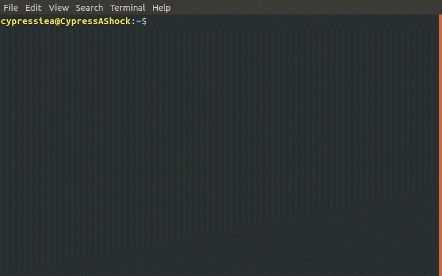

# ROS Sourcing Tools

[](https://travis-ci.com/Briancbn/ros_src_tools)
[](https://opensource.org/licenses/Apache-2.0)

A Bash tool for easily and dynamically sourcing ROS and ROS2 environment.

## Installation
Download the repository to your local computer and run the setup script.
```bash
cd ~
git clone https://github.com/Briancbn/ros_src_tools.git .ros_src_tools
./.ros_src_tools/setup.sh
```
Follow the instructions to setup up your `ros_src_tools`.

Note that by default, the program will search for 
- ROS Installation inside `/opt/ros` 
- ROS workspaces (folder ends with **_ws**) in `~/`

You can change these configurations during the setup.

## Usage

### **srcros**
    
You can run `srcros -h` to show help information
```
usage: srcros [-h] [distro_name] [workspace_name]

Sourcing available ROS distro and ROS workspace.

srcros
    Source Melodic setup.bash by default.

srcros [distro_name]
    Source available distro name found in /opt/ros.

srcros [distron_name] [workspace_name]
    Source available distro name found in /opt/ros
    and then source the workspace name (ends with '_ws')
    found in /home/<username>.
    Workspace name don't need suffix.

srcros -h
    show help information
```
### **roshome**
Change to your latest sourced workspace location. 

This location is defined automatically when you run `srcros`

### **rosdep_intstall_all**
This is equivalent to running the following command
```bash
rosdep install --from-paths src --ignore-src -y --rosdistro "${ROS_DISTRO}"
```

## Uninstall
Simply delete the files created.
```bash
rm -rf ~/.ros_src_tools ~/.ros_shortcut.sh
```